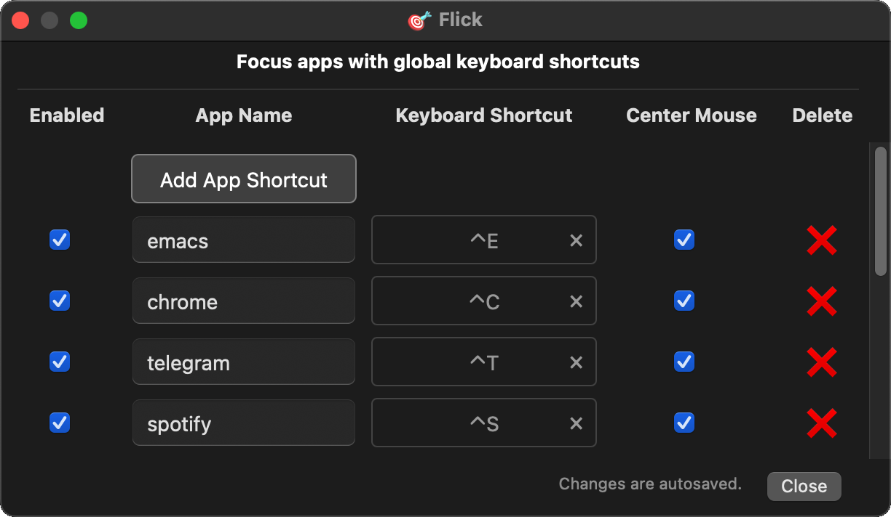

<p align="center">
  
</p>

## flick - focus apps with keyboard shortcuts

Is Emacs the only app you use? The only app installed on your Mac? Of course it is.

But if you're one of the few lost souls who uses multiple apps, plural? Who don't use Emacs to call their mothers and change flat tires?

flick is for you.

<h1 align="center">
  
</h1>

`flick` focuses macOS apps with keyboard shortcuts. It makes switching apps really fast.

Press key. Focus app. That's it.

The cursor is also, optionally, warped to the center of the newly focused window. Reduces mouse travel. Handy. (pun intended)

Flicks wraps `pyobjc`. It's fast - sub 70ms per flick.


### Installation

```
pip install flick
```

Requires macOS and Python3.


### How to use it

Once installed, run the command `flick`. You can background it with:

```
flick &
```

Then click 🎯 in the macOS menu bar to create shortcuts.

To add a flick shortcut, click `Add App Shortcut`. Then enter the name
of the app, like `emacs`. App names are case insensitive.

Add all your commonly used apps and voila: switch apps 10x faster.


### How it works

`flick` listens for global keyboard shortcuts. When a keyboard shortcut
fires, flick:

1. **Finds the app** that matches the app name string. Eg: `chrome` for
   Google Chrome, `emacs` Emacs (😉), `slack` for Slack, etc. App names
   are case-insensitive substrings; `emacs` matches `Emacs`, `emacs`,
   `emacs-29`, etc.

2. **Picks the most recently used window**. If the app has multiple
   windows, the window used most recently is focused. flick continuously
   tracks when windows are focused after startup with macOS's
   Accessibility API. If flick was just started and is thus without a
   history of focused windows, the app's main window is focused by
   default.

3. **Centers the cursor** in the `(x,y)` center of the focused
   window. That way you move the mouse less. You lazy bones.


### Permissions

flick uses the macOS Accessibility API and requires permission on first
run. To otherwise grant flick its needed permissions, go to **System
Settings → Privacy & Security → Accessibility** and enable the terminal
(or whatever parent app) you used to run `flick`.


### Usage

```
flick              # start the daemon
flick -h           # show help
flick --version    # show version
```

### Development

For local development:

- Check out this repo.
- Modify flick.py.
- Run flick.py.
- Have fun.